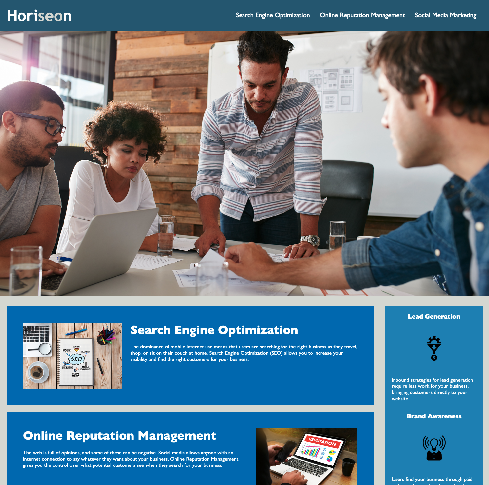

# Horiseon refactor

## Refactor a page for accessibility

[Deployed Link](https://lshillman.github.io/horiseon-refactor/)

Imaginary scenario: Horiseon is a small SEO and marketing agency. They recently determined that their Google page rank was lower than they'd like due to their home page's lack of accessible and semantic elements. They brought me in to clean things up and boost their SEO without changing the UX of their page.

I mainly replaced non-semantic divs with their semantic equivalents. Along the way I combined a lot of redundant CSS styles and changed some image implementations to be nicer to screen readers.

## Technologies used:

* HTML
* CSS
* Git


## Example of semantic code

````javascript
<!--changed hero from div with background-image to image element-->
    
   
    <!--changed content div to semantically-correct "main"-->
    <main>
        <!--deleted classes that should have been IDs. I'm not targeting these IDs with CSS, but leaving them in case they're useful for anchor links, etc-->
        <!--changed divs to sections where appropriate-->
        <section id="search-engine-optimization">
            
            <h2>Search Engine Optimization</h2>
            <p>
                The dominance of mobile internet use means that users are searching for the right business as they travel, shop, or sit on their couch at home. Search Engine Optimization (SEO) allows you to increase your visibility and find the right customers for your business.
            </p>
        </section>
````

## Screenshot of the live page 




## Credits

This was a solo project. I consulted the W3C extensively for accessibility guidance:
https://www.w3.org/WAI/


## License

This project uses the MIT License.
